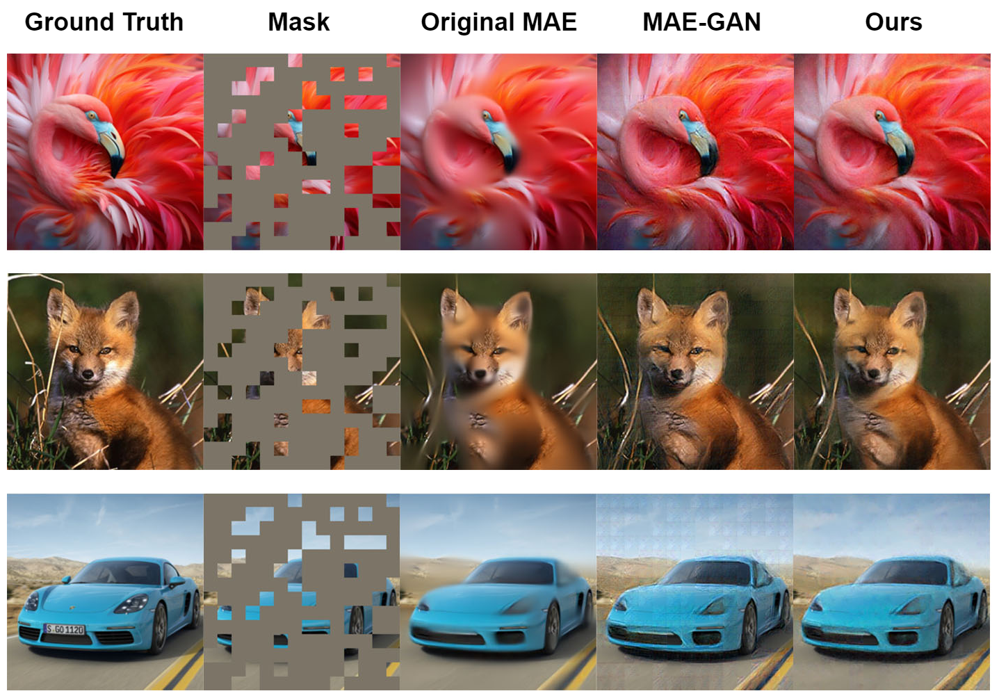

# MAE_GAN

In this project, we explore the use of [Masked Autoencoder (MAE)](https://arxiv.org/abs/2111.06377) in inpainting tasks. By combining MAE with GAN and using perceptual loss functions, we can obtain clear, detailed inpainted images.

For more detail, please read [our document](document/MAE_GAN_Document.pdf).



## Installation

```
pip install -r requirements.txt
```

## Dataset
[PASCAL VOC 2012](https://www.kaggle.com/datasets/huanghanchina/pascal-voc-2012)

17095 RGB images, 80% for training, 20% for testing

## Run
```train_gan.ipynb```: MAE-GAN training and visualization

```train_ganpercep.ipynb```: MAE-GAN + perceptual loss training and visualization

```train_ganbound.ipynb```: MAE-GAN + boundary loss training and visualization

```train_ganbound_percep.ipynb```: MAE-GAN + boundary loss + perceptual loss training and visualization

```train_iprompt.ipynb```: MAE-GAN + boundary loss + perceptual loss for image prompting, training and visualization

```test_quantative_result.ipynb```: Evalation metrics and quantitative results